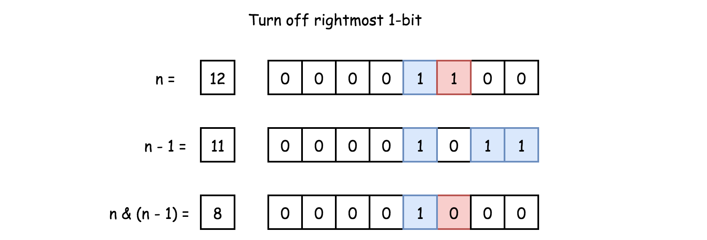

# Brian Kernighan's algorithm

When we do AND bit operation between number `n` and `n-1`, the rightmost bit of one in `n` would be turned off (from one to zero).

Example applications:
- [Count set bits in an integer](https://www.geeksforgeeks.org/count-set-bits-in-an-integer/)
- [Bitwise AND of a number range](https://leetcode.com/problems/bitwise-and-of-numbers-range/)